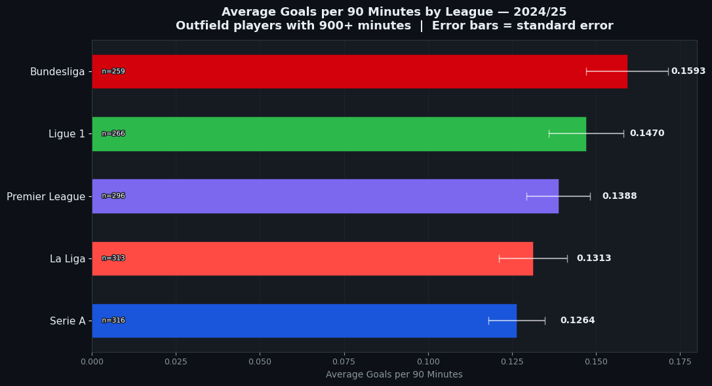
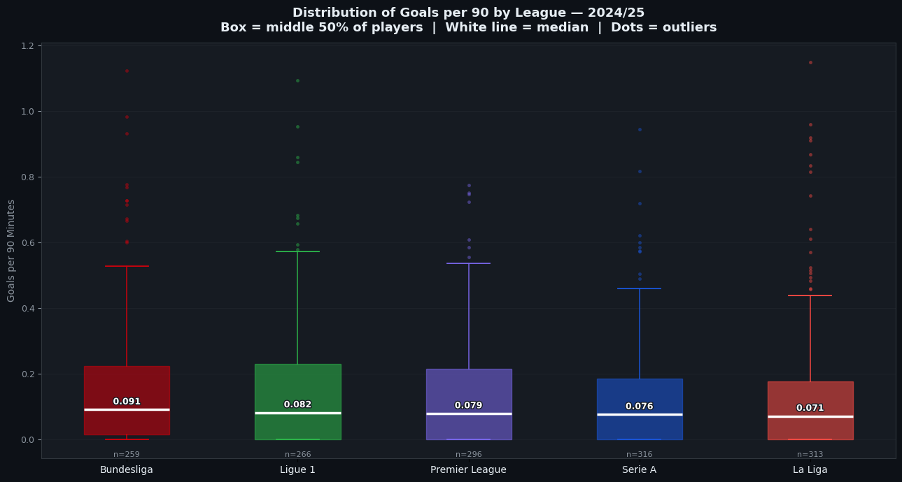
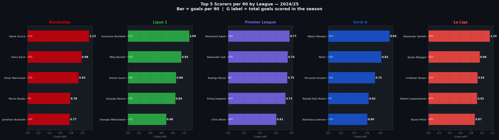
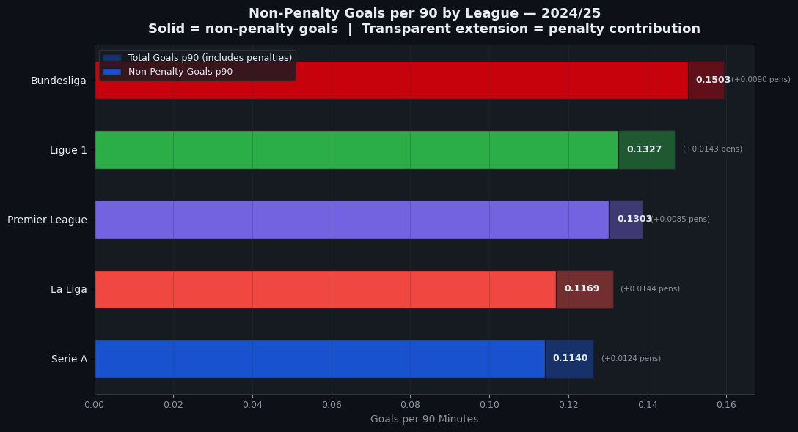

# The League Lab — Part 1: Which League Scores the Most?

**Series:** The League Lab — Dissecting the Top 5 European Leagues with Data  
**Part:** 1 of 6  
**Season:** 2024/25  
**Author:** Antwan Makramallah

---

## Central Question

Which of the Top 5 European leagues produces the highest average goals per 90 minutes among outfield players and is the gap driven by a few elite strikers or consistent across the whole squad?

---

## Key Finding

**The Bundesliga, not the Premier League, leads the Top 5 leagues 
in average goals per 90 minutes.**

Bundesliga averaged 0.1593 goals per 90, 20% higher than the 
lowest-ranked Serie A (0.1264). The Premier League ranked 3th.

---

## Charts

### Average Goals per 90 by League


### Full Distribution — Box Plot


### Top 5 Scorers per League


### Non-Penalty Goals per 90


---

## Data Source

- **Dataset:** Football Players Stats 2024/25 — Big 5 European Leagues  
- **Source:** Kaggle — hubertsidorowicz  
- **Filters applied:** Outfield players only | Minimum 900 minutes played

---

## Tools Used

Python · pandas · matplotlib · seaborn · Jupyter Notebook

---

## How to Run

```bash
pip install pandas numpy matplotlib seaborn jupyter
jupyter notebook notebooks/which-league-scores-the-most.ipynb
```

---

## Series Navigation

| Part | Question | Status |
|---|---|---|
| Part 1 | Which league scores the most? | ✅ Complete |
| Part 2 | Which league creates the best chances? | 🔜 Coming |
| Part 3 | Which league converts chances best? | 🔜 Coming |
| Part 4 | Which league has the most creative players? | 🔜 Coming |
| Part 5 | Who are the top performers across all leagues? | 🔜 Coming |
| Part 6 | The full picture — final league rankings | 🔜 Coming |
